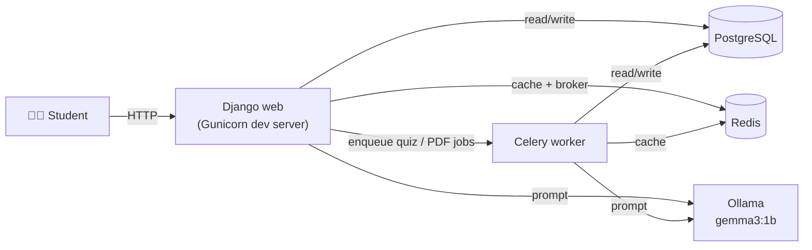

# 🎓 CS Tutor — AI-Powered Lecture Assistant

<p align="center">
  <i>A self-hosted, Dockerized study assistant for Computer Science topics — powered by a locally-running LLM.</i>
</p>

<p align="center">
  
  
  
  
  
  
  
</p>

<p align="center">
  Each student gets their own private chat history per lecture, streaming answers from a local LLM, auto-generated quizzes from their own conversations, and PDF upload &amp; summarization — no external API keys, no cloud LLM costs, everything runs on your machine.
</p>

---

## ✨ Features

| | |
|---|---|
| 💬 **Per-student private chat** | Every user has their own isolated chat history, per lecture topic. |
| ⚡ **Streaming AI responses** | Answers stream in token-by-token over Server-Sent Events, powered by [Ollama](https://ollama.ai/) running `gemma3:1b`. |
| 📝 **Quiz generation** | Turns a student's own conversation history into a 5-question multiple-choice quiz, generated asynchronously with Celery so the UI never blocks. |
| ✅ **Interactive quiz UI** | Click an answer to see instantly whether it's correct, with a running score. Answers persist across page reloads, with a one-click **Retry Quiz** to reset and try again. |
| 📄 **PDF upload & summarization** | Upload a lecture PDF — it's chunked and summarized in parallel (`ThreadPoolExecutor`), then used as extra context for follow-up questions. |
| 🧠 **Response caching** | Redis caches exact and near-duplicate questions (keyword-overlap similarity) so repeated questions don't hit the model again. |
| 🎯 **Off-topic detection** | Each lecture nudges the student back on track if they ask about a different subject. |

## 🏗️ Architecture



All five services are defined in a single `docker-compose.yml` and started together with one command.

## 🧰 Tech Stack

| Layer | Tech |
|---|---|
| Backend | Django 5.1 |
| Async tasks | Celery + Redis (broker/backend) |
| Database | PostgreSQL |
| Cache | Redis (`django-redis`) |
| LLM | Ollama (`gemma3:1b`) |
| PDF parsing | `pdfplumber`, `PyPDF2` |
| Frontend | Django templates + vanilla JS + Bootstrap 5 |
| Orchestration | Docker Compose |

## 🚀 Getting Started

### Prerequisites

- [Docker Desktop](https://www.docker.com/get-started) (includes Docker Compose)
- ~4 GB free disk space for the Ollama image + `gemma3:1b` model

### Run it

```bash
git clone https://github.com/ogulcanzorba/Docker_AI_Project.git
cd Docker_AI_Project

# Build and start every service in the background
docker compose up --build -d

# Run Django migrations (first time only)
docker compose exec web python manage.py migrate

# Pull the LLM into the ollama container (first time only, ~800 MB)
docker compose exec ollama ollama pull gemma3:1b
```

Then open **http://localhost:8000** and sign up for an account. 🎉

### Services

| Service | Purpose | Port |
|---|---|---|
| `web` | Django app | 8000 |
| `postgres` | Database | 5432 |
| `redis` | Cache + Celery broker | 6379 |
| `celery` | Async worker (quiz/PDF generation) | — |
| `ollama` | LLM inference server | 11434 |

### Useful commands

```bash
docker compose logs -f web        # tail Django logs
docker compose exec web python manage.py createsuperuser
docker compose down               # stop everything
```

## 📁 Project Structure

```
Docker_AI_Project/
├── ai_project/          # Django project config (settings, celery app, urls)
├── ai_model/            # Main app: views, models, Celery tasks, PDF processing
│   ├── lectures.py      # Single source of truth for lecture metadata
│   ├── tasks.py         # Celery tasks: quiz generation, PDF summarization
│   └── utils/           # PDF text extraction helpers
├── prompts/             # Per-lecture system prompts fed to the model
├── templates/           # Django templates (chat UI, auth, transcripts)
├── static/              # CSS
├── docker-compose.yml   # Full multi-container stack
└── Dockerfile           # Django app image
```

## 📌 Notes

This project is built for local, single-machine use — `DEBUG`, secret keys, and service passwords are set to convenient defaults in `docker-compose.yml` / `settings.py` rather than production-hardened values.

---

<p align="center"><sub>Built with Django, Celery, and a locally-running LLM — no cloud, no API keys.</sub></p>
